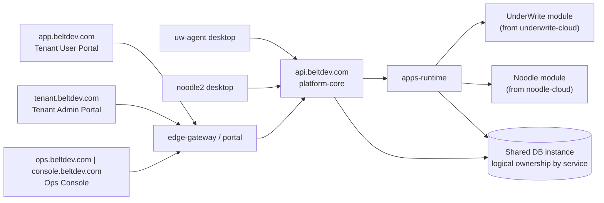

# Architecture (uw-agent-website)

## System Overview
This repository participates in the Belt refactored 3-service backend architecture:
1. platform-core
2. edge-gateway/portal
3. apps-runtime

Public URLs remain stable; only internal service/repo boundaries evolve.

## Architecture Diagram

## External URL Map (Stable)
- Tenant user portal: https://app.beltdev.com
- Tenant admin portal: https://tenant.beltdev.com
- Ops console: https://ops.beltdev.com and https://console.beltdev.com
- Desktop/client API base: https://api.beltdev.com

## API Ownership Rules
1. platform-core owns:
   - /discovery/v1/*
   - /api/platform/*
   - /api/apps/{app}/agent/*
2. apps-runtime owns:
   - /api/apps/underwrite/* (non-agent)
   - /api/apps/noodle/* (non-agent)

## Repo-Specific Role
- Service/component: website/frontend
- Owns: UnderWrite website frontend and deployment wiring compatible with platform/gateway contracts.
- Must not own: Changing backend public API contracts from frontend code assumptions.

## Safe Change Rules
1. Keep public contracts backward compatible.
2. Change contracts in `belt-platform-contracts` first for shared interface updates.
3. Validate auth, discovery, app flows, billing, and provisioning before deployment.
4. Keep rollback path available until post-deploy soak passes.

## Migration Status Notes
- Legacy runtime topology (separate underwrite/ncloud/ops services) is retired from active routing.
- Any remaining legacy references in docs/comments/scripts should be removed opportunistically, but must not alter live public contracts.
